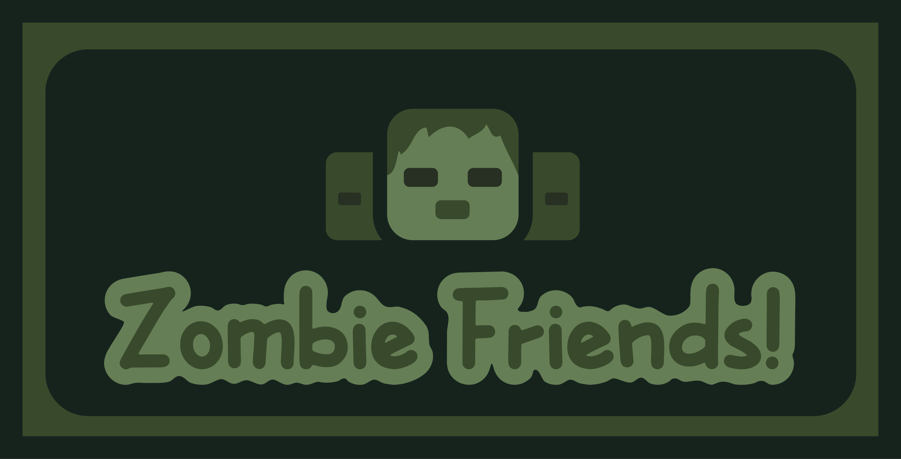

    

  

  

  
  
  

A small mod that adds texture variants for all the new default skins added by Mojang. They will be randomly applied to spawned Zombies but can be manually changed using nametags!

    

